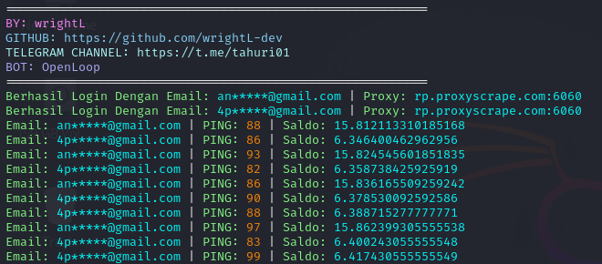

# Open Loop Network




**Fitur:**

**• Multi Akun**

**• Multi Thread**

**• Otomatis PING**

**• Support Proxy/Tanpa Proxy**

## Instalasi

1. **Clone repository ini:**

    ```bash
    git clone https://github.com/wrightL-dev/OL
    cd OL
2. **Instal package yang diperlukan:**

    ```bash
    npm install axios https-proxy-agent
3. **Tambahin list akun di akun.txt, Example:**

    ```plaintext
   email@gmail.com|password123
4. **Jika ingin menggunakan proxy edit file proxy.txt, Example:**

    ```plaintext
   http://username:password@ip_address:port
5. **Perintah jalankan:**

    ```plaintext
   node main.js
## Dukungan

Jika Anda memiliki pertanyaan atau butuh bantuan lebih lanjut, silakan bergabung dengan saluran Telegram kami di [t.me/tahuri01](https://t.me/tahuri01).

## Lisensi

Proyek ini dilisensikan di bawah [MIT License](LICENSE).
